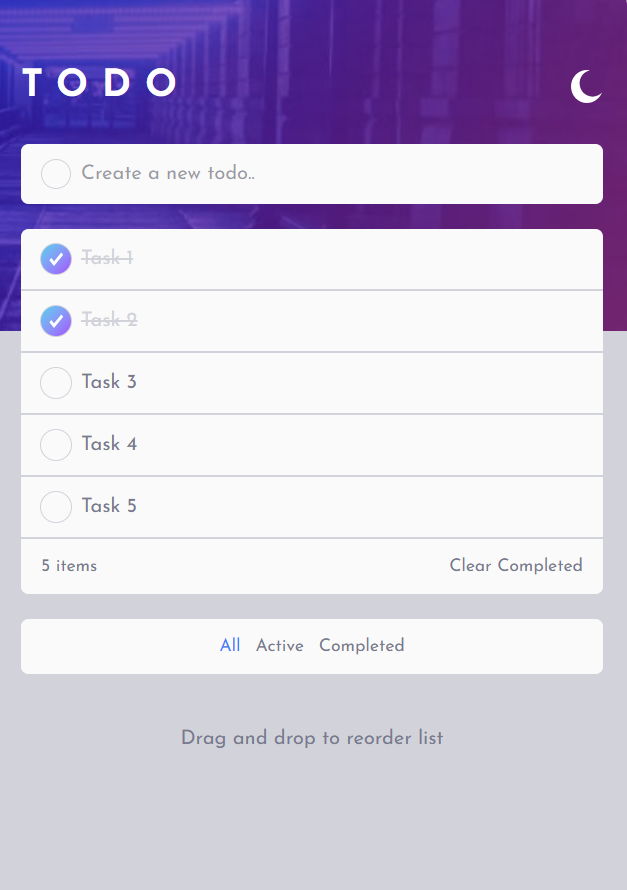

# Frontend Mentor - Todo app solution

This is a solution to the [Todo app challenge on Frontend Mentor](https://www.frontendmentor.io/challenges/todo-app-Su1_KokOW). Frontend Mentor challenges help you improve your coding skills by building realistic projects. 

## Table of contents

- Overview
  - Todo App Challenge
  - Screenshot
  - Links
- My process
  - Built with Vite, React, Tailwindcss, Typescript
  - What I learned
  - Continued development
  - Useful resources
- Author (Kholid Irfangi)
- Acknowledgments

**Note: Delete this note and update the table of contents based on what sections you keep.**

## Overview

### The challenge

Users should be able to:

- View the optimal layout for the app depending on their device's screen size
- See hover states for all interactive elements on the page
- Add new todos to the list
- Mark todos as complete
- Delete todos from the list
- Filter by all/active/complete todos
- Clear all completed todos
- Toggle light and dark mode
- Store data in localstorage
- Drag and drop to reorder items on the list

### Screenshot

#### Desktop View

#### Mobile View

#### Theme Light

### Links

- Solution URL: [solution here](https://github.com/kholidirfangi/todo-app)
- Live Site URL: [live site URL here](https://todo-app-one-theta-37.vercel.app/)

## My process

### Built with

- Semantic HTML5 markup
  I try to use semantic HTML5 tag to create structure clearl, SEO friendly, increase accessibility and easy to understand other developer

- Vite
  Vite is build tool for frontend, i use vite because vite is fast

- Tailwindcss
  I use tailwindcss, because tailwindcss is css framework utility base. With tailwindcss i can custome ui easyly and light code, because tailwindcss only compile the class is used.

- Mobile-first workflow
  I started from the mobile view first, then to the desktop view. Because there are several advantages, namely more user friendly, fast loading, improved SEO, more focused design, and easier to increase to the screen width above.

- React
  React is library to build UI from Meta. React is a popular Frontend library. React is component base, we can build one component, and if we need some same component, we just need to call the component we have build before.

- Typescript
  In this challenge is the firts i using typescript for my project, typescript is usefull to declare types of data to prevent the error in production.

- [React](https://reactjs.org/) - JS libraryFor styles
- [Vite](https://vite.dev/) - Build tool for frontend
- [Tailwindcss](https://tailwindcss.com/) - CSS Framework
- [Typescript](https://www.typescriptlang.org/) - JavaScript with syntax for types.

### What I learned

In this project i learn a lot.
1. I learn how to setup project using vite build tool with react ts template and integrate with tailwindcss
2. How to create structure clearly with separate directory base on functionality
3. I learn how to declate interface and type using typescript
4. How to create a conditional rendering to show different layout with different condition.
5. Learn how use interact with input checkbox
6. Learn how to use hooks in React, such a useState, useEffect, useMemo, useReducer
7. Learn how to create a custome hooks for clean code practice
8. Learn how to create a dragable element

### Continued development

I will continued learning after this project done. My plan is to learn how to consume API in the next project. My goal is to became a Full Stack Developer.

### Useful resources

- [Chat GPT](https://www.example.com) - This helped me for give me a imagine how to build app with best practice.
- [Claude.ai](https://claude.ai/) - This is similar Chat GPT, but this AI is can show the visual from the code, this is also very usefull  to help me create a code, and then i try to understanding the code and transfer the knowlegde to my brain.

## Author

- Website - [Kholid Irfangi](https://new-portfolio-lovat-kappa.vercel.app/)
- Frontend Mentor - [@yourusername](https://www.frontendmentor.io/profile/yourusername)
- Instagram - [@kholid.irfangi](https://www.instagram.com/kholid.irfangi)

## Acknowledgments

I recomended if you are start learning code now, you have to use AI to help you, ask AI to teach you what you will learn and don't just copy and paste solution from AI give you, but try to understanding and after you done build the project with help AI try to build the same project without AI help. If you can build the project without AI, it's mean you have understood.

Thank you for Fronted Mentor who has provided this challenge.

